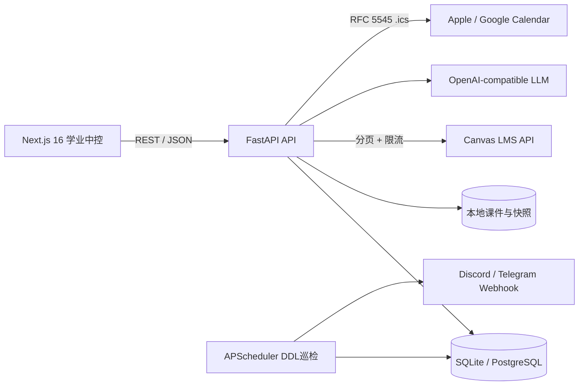

# Canvas Academic OS

Canvas 学业操作系统是一套面向单个学生的本地优先学习工作台：从 Canvas 同步课程与作业，到 DDL 预警、日历订阅、课件归档、AI 复习卡片、GPA What-if、待办与专注打卡，最后把结课资料沉淀为可离线保存的快照。

项目默认使用 SQLite 和 Docker Compose，适合个人电脑开箱运行；数据库访问层基于 SQLModel/SQLAlchemy，后续可通过 `DATABASE_URL` 切换到 PostgreSQL。

## 1. 系统架构



容器职责：

| 服务 | 端口 | 作用 |
| --- | ---: | --- |
| `backend` | `8000` | FastAPI、同步 API、日历、GPA、材料与快照 |
| `scheduler` | — | 独立 APScheduler 进程，周期巡检 DDL 并执行去重提醒 |
| `frontend` | `3000` | Next.js 现代化学业中控看板 |

## 2. 一键启动

要求：Docker Desktop（包含 Docker Compose v2）。

```bash
./start.sh
```

第一次启动会自动复制 `.env.example` 为 `.env` 并设置为仅当前用户可读。编辑 `.env`，填入 Canvas 配置后重新启动即可同步真实数据：

```bash
CANVAS_BASE_URL=https://your-school.instructure.com/api/v1
CANVAS_API_TOKEN=your-personal-access-token
CANVAS_ENCRYPTION_KEY=your-fernet-key
```

### University of Melbourne

墨尔本大学 Canvas 的 API 地址使用：

```bash
CANVAS_BASE_URL=https://canvas.lms.unimelb.edu.au/api/v1
CANVAS_USER_AGENT=AcademicOS/0.1 (Canvas integration)
```

墨大对 Canvas access token 有额外管理要求：学生/教职员工需要按照学校流程通过 ServiceNow 向 Teaching and Learning Innovation 申请，拿到 Token 后再到 Canvas 个人 Settings 中激活。Token 等同于账号密码，应当只保存在本机 `.env` 或系统密钥链中；不要发到聊天、Issue 或 Git。详见学校的 [Canvas access tokens 指南](https://lms.unimelb.edu.au/staff/guides/canvas/administration-of-the-lms/canvas-access-tokens)。

后台运行：

```bash
docker compose up -d --build
docker compose logs -f backend scheduler frontend
```

停止服务但保留本地数据库和课件：

```bash
docker compose down
```

数据持久化在仓库根目录的 `data/`，该目录已被 `.gitignore` 排除，绝不会随 Git 提交。

打开：

- 前端看板：<http://localhost:3000>
- 后端 Swagger：<http://localhost:8000/docs>
- 健康检查：<http://localhost:8000/api/health>

## 3. 环境变量

所有变量都可以写入 `.env`。不要提交真实 `.env`、Canvas PAT、LLM Key 或下载的课件。

| 变量 | 默认值 | 说明 |
| --- | --- | --- |
| `DATABASE_URL` | `sqlite:///./data/academic_os.db` | SQLite 路径；生产可替换 PostgreSQL URL |
| `CANVAS_BASE_URL` | Canvas 公共站点 | 学校 Canvas 的 `/api/v1` 地址 |
| `CANVAS_API_TOKEN` | 空 | Canvas Personal Access Token |
| `CANVAS_USER_AGENT` | `AcademicOS/0.1 (Canvas integration)` | 发给 Canvas 的应用标识；墨大 API 要求描述性 User-Agent |
| `CANVAS_ENCRYPTION_KEY` | 空 | Fernet 密钥，用于应用层安全保存 Token |
| `CANVAS_REQUEST_TIMEOUT_SECONDS` | `30` | Canvas 单次请求超时 |
| `CANVAS_MAX_RETRIES` | `3` | 网络错误与限流重试上限 |
| `CANVAS_MIN_RATE_LIMIT_SLEEP_SECONDS` | `0.25` | 低剩余配额时的最小等待 |
| `CANVAS_MAX_RATE_LIMIT_SLEEP_SECONDS` | `8` | 自适应退避上限 |
| `SCHEDULER_ENABLED` | `false` | Compose 的 scheduler 服务会显式设为 `true` |
| `DDL_ALERT_POLL_INTERVAL_MINUTES` | `15` | DDL 巡检周期 |
| `ALERT_WEBHOOK_URL` | 空 | Discord、Telegram 或通用 Webhook |
| `ALERT_WEBHOOK_KIND` | `generic` | `generic` / `discord` / `telegram` |
| `LLM_BASE_URL` | OpenAI API | OpenAI-compatible API 地址 |
| `LLM_API_KEY` | 空 | AI 复习卡片密钥 |
| `LLM_MODEL` | `gpt-4o-mini` | 低成本快速抽取模型 |
| `FRONTEND_ORIGIN` | `http://localhost:3000` | FastAPI CORS 来源 |
| `NEXT_PUBLIC_API_URL` | `http://localhost:8000` | 浏览器访问后端的地址 |

生成 Fernet 密钥：

```bash
python -c "from cryptography.fernet import Fernet; print(Fernet.generate_key().decode())"
```

## 4. Canvas Token 获取

1. 按学校流程通过 ServiceNow 申请 Canvas access token，写明用途和需要的时间范围。
2. Token 获批后，登录 Canvas，在个人 **Settings** 中激活它。
3. 将 Token 写入本机 `.env` 的 `CANVAS_API_TOKEN`，不要放进代码、截图、Issue 或 Git。
4. 同时设置 `CANVAS_ENCRYPTION_KEY`，应用在需要持久化 Token 时使用 Fernet 加密。

首次同步可通过 Swagger 或命令行调用：

```bash
curl -X POST http://localhost:8000/api/sync/courses
curl -X POST http://localhost:8000/api/sync/assignments
curl -X POST http://localhost:8000/api/sync/materials
curl -X POST http://localhost:8000/api/sync/grades
curl -X POST http://localhost:8000/api/sync/submissions
```

Canvas 客户端会：

- 解析 RFC 5988 `Link` 响应头，持续拉取 `next` 页面直到结束；
- 读取 `X-Rate-Limit-Remaining`，在配额紧张时动态延迟；
- 对网络异常、429、5xx 使用有上限的指数退避；
- 通过 Canvas `updated_at` 与本地 SHA-256 避免重复写入和下载。

## 5. 日历订阅

标准 ICS 接口：

```text
http://localhost:8000/api/calendar/feed.ics
http://localhost:8000/api/calendar/feed.ics?course_id=1
http://localhost:8000/api/calendar/feed.ics?include_assignments=true&include_events=true
```

部署到 HTTPS 域名后，将 `https://学业系统域名/api/calendar/feed.ics` 转换为 `webcal://学业系统域名/api/calendar/feed.ics`，即可作为订阅地址：

- Apple Calendar：文件 → 新建日历订阅 → 粘贴 `webcal://` 地址；
- Google Calendar：其他日历 → 通过 URL 添加 → 粘贴可公开访问的 `.ics` 地址；
- 手机端：使用同一账户的日历订阅同步，不要把 PAT 放入 URL。

日历事件使用 RFC 5545，DDL 会标记为 `DEADLINE`，课堂事件标记为 `CLASS`。当前 Feed 为单向发布，编辑需回到 Canvas 或 Academic OS。

## 6. 功能 API 目录

| 模块 | 主要端点 |
| --- | --- |
| 系统 | `GET /api/health` |
| Canvas 同步 | `POST /api/sync/courses`, `/assignments`, `/materials`, `/grades`, `/submissions` |
| 日历 | `GET /api/calendar/feed.ics` |
| 课件 | `GET /api/courses/{course_id}/materials.zip` |
| AI 卡片 | `POST /api/materials/{material_id}/flashcards/generate`、`GET /api/flashcard-jobs/{job_id}`、`GET /api/courses/{course_id}/flashcards.anki` |
| 成绩 | `GET /api/courses/{course_id}/grades/summary`、`POST .../grades/what-if` |
| 快照 | `GET /api/courses/{course_id}/snapshot?format=json` 或 `format=html` |
| 待办 | `GET /api/todos/today`、`POST /api/todos`、`PATCH /api/todos/{todo_id}/complete` |
| 专注 | `POST /api/focus/start`、`POST /api/focus/{id}/pause`、`resume`、`complete` |
| 分析 | `GET /api/analytics/focus` |

DDL 预警分为 `7d`、`3d`、`24h`、`3h` 四档。每个作业、截止时间、档位、渠道组合生成唯一去重键，重复巡检不会刷屏；已提交作业不再触发提醒。

## 7. GPA What-if 算法

每个 Assignment Group 先按得分计算组内百分比，再乘 Canvas 权重：

```text
当前加权总评 = Σ(Assignment Group 权重 × 组内得分率)
最大可得总评 = 当前已知贡献 + 剩余项目全部按 100 分计算的贡献
期末所需平均分 = (目标总评 - 当前已知贡献) / 剩余项目的有效权重
```

接口同时返回：

- `required_average_percent`：剩余考核项需要的平均百分比；
- `required_points`：按剩余项目总分换算的最低原始分；
- `max_possible_percent`：满分情况下的可达上限；
- `feasible`：目标是否在 0–100 分范围内可实现；
- `reason`：目标不可行或没有剩余考核项时的解释。

前端滑块是演示入口，实际课程 ID 接入后调用 `/api/courses/{course_id}/grades/what-if`。

## 8. 结课快照与本地安全

`/api/courses/{course_id}/snapshot` 会把课程、作业、提交历史、成绩、Rubric JSON 与评语写入 `data/snapshots/`，支持 JSON 和 HTML 两种离线格式。建议每门课结束前导出并复制到个人加密备份。

生产部署建议：

1. 使用 HTTPS 反向代理，不直接暴露 Uvicorn 到公网。
2. 将 `.env` 放在秘密管理器或受限文件系统中。
3. 定期轮换 Canvas PAT、LLM Key 与 Fernet 密钥；Fernet 密钥轮换前先完成旧 Token 解密迁移。
4. 将 `data/` 纳入加密备份，不把真实课件同步到 Git。
5. 多用户部署时增加认证、租户隔离、CSRF 防护与审计日志；当前版本定位为本地单用户工作台。

## 9. 本地开发与验证

后端：

```bash
uv sync --dev
./.venv/bin/ruff check backend
./.venv/bin/pytest -q
```

前端：

```bash
cd frontend
pnpm install
pnpm typecheck
pnpm build
pnpm dev
```

完整工程验证覆盖 Canvas 客户端分页/限流、数据库初始化、DDL 预警去重、ICS 格式、课件 SHA-256 去重、Anki 输出、GPA 边界、待办排序、专注状态机与前端生产构建。

## 10. 目录结构

```text
backend/app/
├── api/             # FastAPI 路由
├── alerts/          # DDL 预警与 Webhook
├── ai/              # LLM 考点与 Anki 卡片
├── calendar/        # RFC 5545 ICS
├── canvas/          # 分页、限流与重试客户端
├── grades/          # 成绩同步与 What-if 算法
├── materials/       # 课件同步、归档与 ZIP
├── productivity/    # 待办、专注、学习统计
├── snapshots/       # 结课离线快照
└── sync/            # Canvas 增量同步编排
frontend/
├── app/             # Next.js App Router 与全局样式
├── components/      # Academic OS 中控看板
└── lib/             # 后端 API 类型与请求封装
docker-compose.yml   # backend + scheduler + frontend
start.sh             # 自动初始化 .env 并启动 Compose
```
